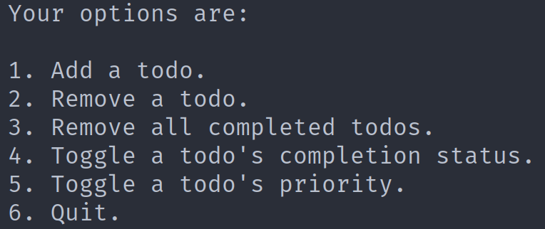

# Todo Part 1 - TodUI

* You'll start with the `readLine` interface code, because that's annoying template code. But you don't have `readline` itself available in your code yet. (If you run `node main.js` you'll get an error that `readline` hasn't been defined, which makes sense, given that it's a variable we haven't declared yet.) So! `require` it in. Now `readline.createInterface` exists, and you can use the boilerplate code that gives you that `interface` variable to use.
* Since we'd like to continue to display the menu for the user until they're ready to quit, it makes sense to save it into a variable. What we want is a multi-line string with 6 numbered options: add a todo, remove a todo, remove all completed todos, toggle a todo's completeness, toggle a todo's priority from high to low, and quit. Preferably it goes on multiple lines, so it can look _something_ like this:

  You can always reword it however you'd like, as long as you've got all those options. And whether you use a backtick string or `\n` to make new lines, **make sure it's on multiple lines**!
  
  Now that we've got it saved, we'll be able `console.log` it whenever we want, or make it the first argument (the prompt) to `interface.question`.
  
  For now, feel free to `console.log` it and run `node main.js`. See if it prints out the way you want it to!
* Now let's define a function to run when they select something from that menu. For now, let's `console.log` out a message for ourselves that our function is running, and then run `interface.close()`, which will quit out of our node app. Don't worry about CALLING the function yet; remember, node will do that for us if we have everything wired together correctly! (Which we'll do shortly.)
* Now, at the bottom of our file, let's run `interface.question`, pass it our menu string as its first argument, and pass it our menu-handling function as its second argument. What this will do is print out our menu, and then call our function once the user enters some input.
* Let's try it out. Run `node main.js`. You should see your menu printed out, and, when you type something (anything) in, it will print out our `console.log` and quit. We have an async callback working! It doesn't DO anything, but... it works.
* Of course, no user interface is particularly good unless we're doing something with their input. When `interface` gets a response from the user, it passes it into the callback function we registered with it when we called `interface.question`. So our menu handler can take in a parameter if we want to use that input (which we do). Call it `choice` or `selection` or `userInput` or whatever you'd like, and then change hte `console.log` to printing out `You chose: ` and that user input. Now run your code, enter something in, and you should get that something echoed back to you (followed by a quit).
* Let's finish up part 1 by making it so that our app keeps going until we actually want to quit. Some of our `readline` apps have solved the problem of how to "ask again" by having a new function that repeats the question, but we want the user to be able to do as many todo-related tasks as they want before quitting, and we're not going to write an infinite number of functions to handle how deep they might go with their followups. So how do we do that?
* We'll simply have the function ask again, and register _itself_ as the `interface.question` handler. Pretty weird concept at first, but the function isn't actually calling itself; just telling node to call it again when the user has a response. So we can say that if the user's selection is `6`, we quit (`interface.close()`), and otherwise, tell them to type `6` if they want to quit, then run the exact same code we did to kick this all off, passing the menu and the menu-handling function to `interface.question`.
* If you've got the flow right, you should have an app that continuously presents a menu to you, asks you what you want to do... and then does nothing, asking again until you choose `6` and quit. But! We now have a basic looping menu structure that we can add whatever features we want to.
* For the next part of this project, we'll actually start implementing those 1-5 options!
